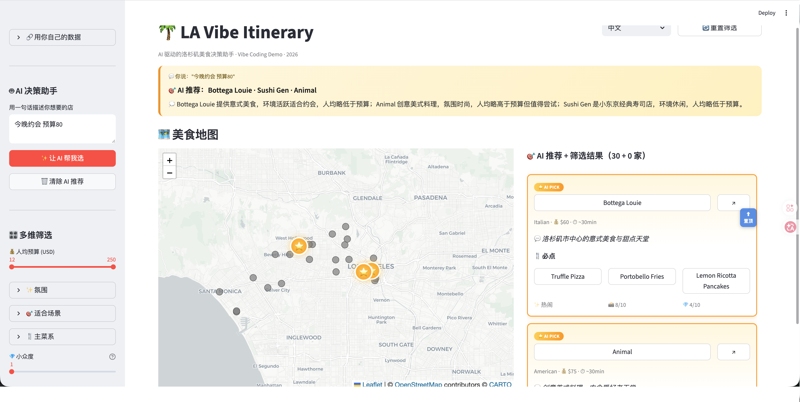
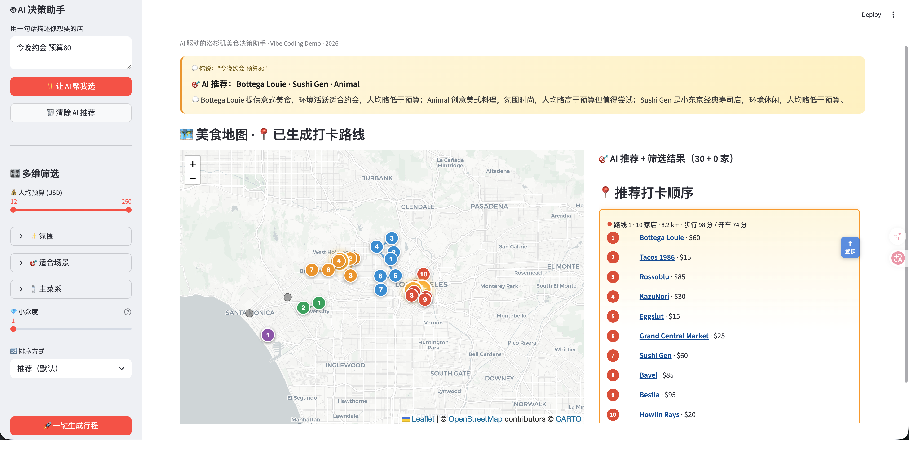

# 🌴 LA Vibe Itinerary

> 把 Google Maps 收藏夹变成可执行打卡攻略的 AI Agent —— 自然语言选店 · 地理聚类 · TSP 最优路径

[](https://la-vibe-itinerary.streamlit.app)
[](https://python.org)
[](https://openrouter.ai)
[](https://streamlit.io)



---

## 它解决什么问题

Google Maps 收藏夹里攒了几十家想去的店，但面对一堆店名根本不知道怎么选——哪家适合今晚的场景？预算合适吗？哪几家离得近可以连着打卡？

**这个工具让你说一句话，AI 帮你决策**：

1. 输入"今晚约会 预算80"
2. GPT-4o 在符合条件的店里语义匹配，高亮推荐 2-4 家（地图金色 ⭐，卡片 AI PICK 标签）
3. DBSCAN 自动把附近的店归成一组，TSP 算出最短打卡路径
4. 地图上画出彩色路线，点卡片名称即跳转到对应位置

[](https://www.loom.com/share/8dae50afd08443ee87860f2fb68c9a87)

▶️ **[点击图片观看完整 Demo](https://www.loom.com/share/8dae50afd08443ee87860f2fb68c9a87)**

**操作流程（约 3 分钟）：**

1. 侧边栏 AI 框输入 `今晚约会 预算80` → 点击 **✨ 让 AI 帮我选**
2. 地图上出现金色 ⭐ 闪烁 marker，右侧卡片高亮显示 AI 推荐
3. 点击任意店铺名称 → 地图自动跳转到该店并显示蓝色定位圆环
4. 侧边栏调整氛围筛选（如"浪漫"）+ 预算滑块
5. 点击 **🚀 一键生成行程** → 地图上出现彩色虚线路径 + 编号 marker
6. 右侧展开路线详情，点击 **🗺️ 在 Google Maps 看路线** 一键导出至手机地图

---

## 技术架构

```
【离线管线】（数据准备阶段，运行一次）

Google Maps 收藏
       ↓
  Playwright 抓取 / Google Takeout 解析
       ↓
 my_places.csv（5 列原始数据）
       ↓
  GPT-4o 增强（Pydantic 强校验 + 文件缓存）
       ↓
enriched_places.csv（25 列 · 双语 · 20 维 AI 标签）
       ↓
  DBSCAN 聚类（haversine）+ 簇内 TSP / 贪心
       ↓
   routes.json


【实时 Web 层】（Streamlit app.py · ~1200 行）

  侧边栏：多维筛选 + AI 自然语言查询
  左栏（60%）：folium 交互地图 · 状态感知 marker
  右栏（40%）：可滚动卡片 · 行程详情 · 一键 Google Maps 导航
```

---

## 关键技术决策

### 为什么用 DBSCAN 而不是 K-means？
用户的收藏在地理上分布不均匀：有 5 家集中在 DTLA，也有 3 家散落在 Santa Monica。K-means 需要预设 K 且会强行归并离群点；DBSCAN 能自动发现密集簇，并把孤立的店标为"独立站点"，无需人工干预。

### 为什么用 Pydantic 约束 GPT-4o 输出？
GPT-4o 在没有 schema 约束时会产生漂移，比如 `cuisine_primary` 输出 "California Bakery"（业态，不是菜系）。用 `Literal[25 种标准菜系]` 枚举 + tenacity 指数退避重试，强制标准化输出，下游筛选逻辑不需要额外容错处理。

### 为什么双语内容在数据管线里预生成？
运行时实时翻译 = 每次页面加载消耗 API 调用 + 5-10 秒延迟。将 `_zh` / `_en` 字段在 `02_process_data.py` 阶段一次性生成，运行时零成本切换语言。Pydantic schema 确保两个字段同时存在，不会出现"只有中文没有英文"的情况。

### 为什么 AI 查询时要做预算硬过滤而不只是软匹配？
测试发现 GPT-4o 的"软约束匹配"会把超预算的店也推出来（理由是"略超但值得"）。解决方案：在把数据传给 AI 之前，先用 `parse_budget()` 从 query 里提取预算数字，把候选池硬截断到 `price_per_person_usd ≤ budget`，再让 AI 在合规范围内做语义选择。

---

## 技术栈

| 层 | 工具 | 选择理由 |
|---|---|---|
| LLM | GPT-4o via OpenRouter | 多模型统一接口，兼容 OpenAI SDK，方便切换 |
| 数据校验 | Pydantic v2 | 强 schema 约束 + 类型安全，LLM 输出可信赖 |
| 重试策略 | tenacity | 指数退避，3 次失败才放弃，避免偶发 API 错误丢数据 |
| 聚类 | scikit-learn DBSCAN | 无需预设 K，自动识别孤立点，地理分布场景天然适配 |
| 距离度量 | Haversine | 球面距离，地理坐标计算的正确姿势 |
| 路径优化 | 暴力 TSP / 最近邻贪心 | 簇 ≤8 用全排列最优解；>8 用启发式，在精度和性能间取平衡 |
| 前端 | Streamlit + folium | 最快的 Python 数据应用路径，folium 地图嵌入丝滑 |
| 抓取 | Playwright | 现代化自动化，支持 Google Maps 共享列表 |
| 部署 | Streamlit Community Cloud | 免费、5 分钟上线、代码推送自动重部署 |

---

## 本地快速启动

```bash
# 1. 环境
conda create -n lbs python=3.12 -y && conda activate lbs
pip install -r requirements.txt

# 2. API Key（去 https://openrouter.ai/keys 申请，免费额度够用）
cp .env.example .env   # 编辑 .env，填入 OPENROUTER_API_KEY=sk-or-...

# 3. 用样例数据跑起来（30 家 LA 餐厅，已预处理）
streamlit run app.py   # 浏览器自动打开 http://localhost:8501

# 4. 可选：用你自己的 Google Maps 数据
cp data/my_places.csv data/my_places_backup.csv  # 备份
# 替换 my_places.csv 为你的数据，然后：
python scripts/02_process_data.py   # GPT-4o 增强，~30 家店约 $0.20、1 分钟
python scripts/03_cluster_routes.py # 聚类 + 路径优化，即时完成
```

---

## 这个框架是城市无关的

当前 LA 美食版只是**参考实现**。同样的管线可以做：

- 🍣 东京拉面探店地图
- ☕ 上海独立咖啡馆清单
- 🏋️ 你城市的健身房推荐
- 🛍️ 任何 Google Maps 收藏场景

Fork → 替换 `data/my_places.csv` → 跑管线 → 部署，得到你专属的决策工具。

---

## 项目数字

| 指标 | 数值 |
|---|---|
| 收录餐厅 | 30 家（Bestia · Sushi Gen · Spago 等 LA 代表性餐厅） |
| AI 标签维度 | 20 维 × 30 店 = 985+ 结构化数据点 |
| 地理聚类 | 5 个核心商圈 + 8 个独立站点 |
| 管线成本 | 全量增强约 $0.20，调试总计不超过 $1 |
| 主程序体量 | app.py 单文件 ~1200 行，含完整双语 i18n |

---

## 项目结构

```
la-vibe-itinerary/
├── app.py                      # Streamlit 主程序（~1200 行，单文件）
├── requirements.txt
├── .env.example                # API Key 模板
├── prompts/
│   └── enrich_prompt.txt       # 20 维度 GPT-4o Prompt（含 few-shot 示例）
├── scripts/
│   ├── 01_scrape_maps.py       # Playwright 抓取 Google Maps 共享列表
│   ├── 01b_parse_takeout.py    # Google Takeout 解析（兜底方案）
│   ├── 02_process_data.py      # GPT-4o 增强 + Pydantic 校验 + 文件缓存
│   └── 03_cluster_routes.py    # DBSCAN 聚类 + 路径优化
├── data/
│   ├── my_places_sample.csv    # 30 家 LA 样例（开箱即用）
│   ├── enriched_places.csv     # 管线输出（25 列双语）
│   └── routes.json             # 聚类结果
└── docs/demo_screenshots/      # README 截图
```

---

## Roadmap

- [ ] **多模态增强** — 抓取店铺照片，用 GPT-4V 自动评估 Instagrammable 度
- [ ] **协同过滤** — 基于用户历史选择做个性化推荐
- [ ] **多日行程规划** — 支持跨天、跨城市的行程编排
- [ ] **无障碍支持（a11y）** — 键盘导航 + 屏幕阅读器兼容

---

## License

MIT
